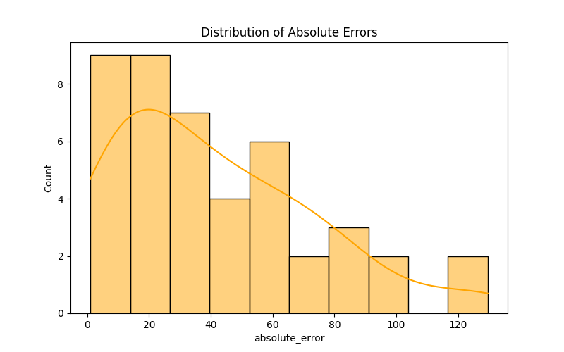

# Business using ML - Microservice architecture

Пример микросервисной архитектуры с RabbitQM.

## Структура проекта
```
microservice_architecture
    └─features
        └─src
            └─features.py
        └─Dockerfile
        └─requirements.txt
    └─model
        └─src
            └─model.py
            └─myfile.pkl
        └─Dockerfile
        └─requirements.txt
    └─metric
        └─src
            └─metric.py
        └─Dockerfile
        └─requirements.txt
    └─plot
        └─src
            └─plot.py
        └─Dockerfile
        └─requirements.txt
```

 - `features` - выполняет подготовку данных для предикта модели.
 - `model` - скрипт кастит предсказания модели и передает их дальше для оценки метрик.
 - `metric` - оценивает качество моделей и логирует абсолютные ошибки.
 - `plot` - по логам скрипта `metric` рендерит график распределения абсолютных ошибок.

## Запуск проекта

Для запуска достаточно иметь установленный docker и docker-compose, для проверки что у вас уже установлен docker-compose, запустите:
```shell
docker-compose version
```

Далее нужно перейти в корневую директорию проекта, и вполнить билд и запуск проекта:
```shell
docker-compose up -d
```
## Результаты выполнения

Проект генерирует 2 артефакта - лог абсолютных ошибок и график по ним,
по этому compose файл был настроен так что бы отдавать эти артефакты наружу с помощью volumes.
Таким образом в корень проекта попадает папка `logs`, в которой содержатся артефакты.

 - [metric_log.csv](./logs/metric_log.csv)
 - [error_distribution.png](./logs/error_distribution.png)

